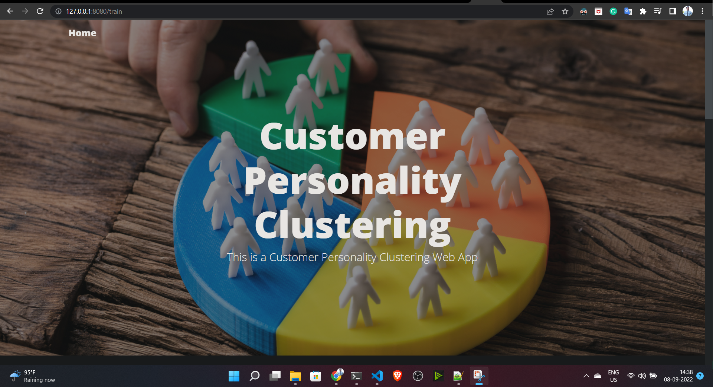
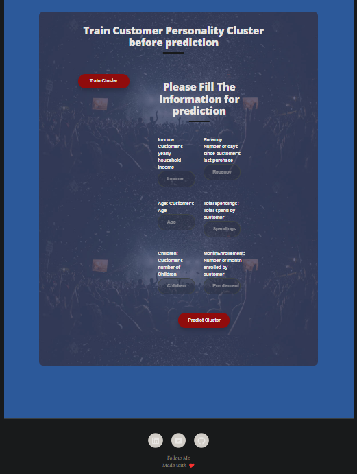
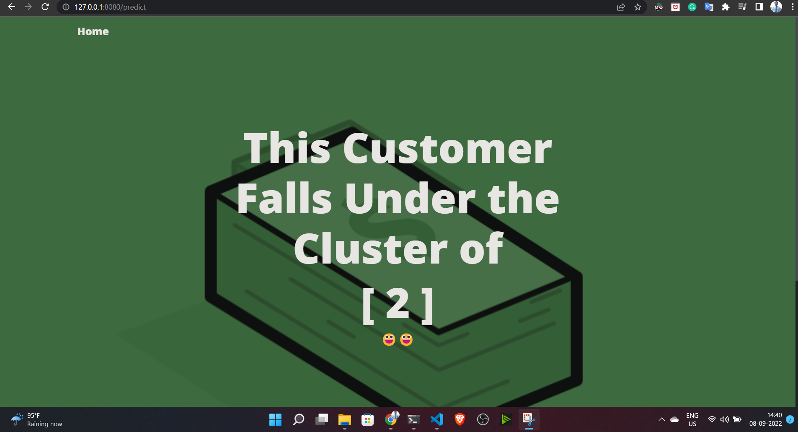

# Project: Customer Personality Analysis


### Customer Personality Analysis using KMeans clustering

In this data science project, you will learn how to perform Customer Personality Analysis using KMeans clustering

Customer Personality Analysis is a detailed analysis of a company’s ideal customers. It helps a business to better understand its customers and makes it easier for them to modify products according to the specific needs, behaviors and concerns of different types of customers.

Customer personality analysis helps a business to modify its product based on its target customers from different types of customer segments. For example, instead of spending money to market a new product to every customer in the company’s database, a company can analyze which customer segment is most likely to buy the product and then market the product only on that particular segment.

Dataset url: [Kaggle](https://www.kaggle.com/datasets/imakash3011/customer-personality-analysis?resource=download)





### Note:

If you want to understand this entire project overflow, please refer the jupyter notebook file inside
notebook folder.

# Demo:





# Built With
1. Flask
2. Machine learning
3. KMeans algorithms
4. Python

# How to run?
### STEPS:

Clone the repository

```bash
https://github.com/entbappy/Customer-Personality-Analysis.git
```
### STEP 01- Create a conda environment after opening the repository

```bash
conda create -n personality python=3.7.10 -y
```

```bash
conda activate personality
```


### STEP 02- install the requirements
```bash
pip install -r requirements.txt
```


Now run,
```bash
python app.py
```

Now run,
```bash
Now open up your browser and type http://127.0.0.1:8080/

Yeah you are ready to go!!😀😀
```

```bash
Note: Before doing the predictions first train it for generating models
```


